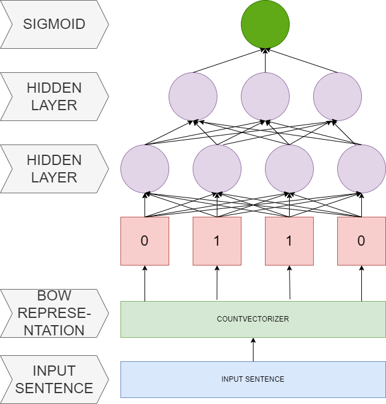

# Multilingual-Sentiment-Analysis
## Notebooks
1. **Sentiment analysis using Multi Layer Perceptron**:

    **Filename**: Data Processing and MLP.ipynb
    
   **Content**: 
      * Basic data cleaning and processing
      * Exploratatory data analysis
      * Data spliting
      * Use of vectorization (CountVecotrizer)
      * MLP model

    
2.  
